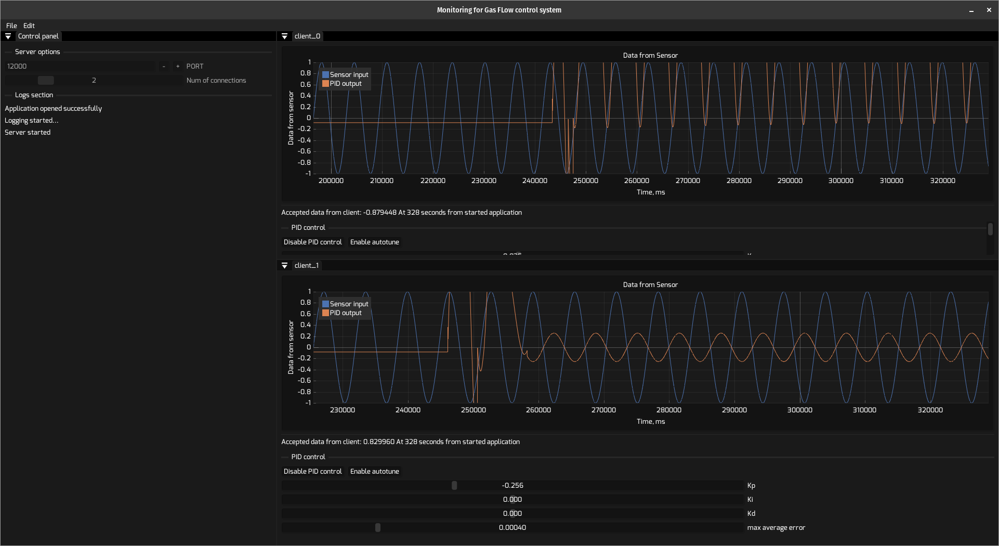
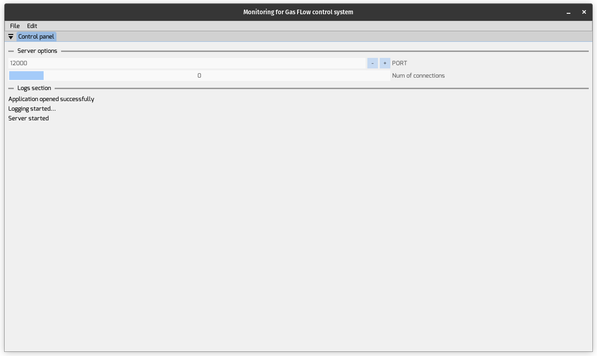
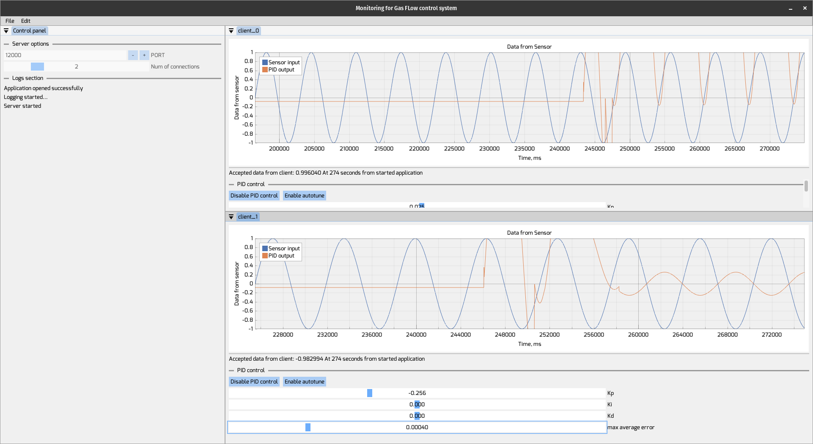

[//]: # ([![Linux Build]&#40;https://github.com/OlegSirenko/Monitoring_GasFlowControll/actions/workflows/cmake-single-platform.yml/badge.svg?event=push&#41;]&#40;https://github.com/OlegSirenko/Monitoring_GasFlowControll/actions/workflows/cmake-single-platform.yml&#41;)

[//]: # ([![Windows build]&#40;https://github.com/OlegSirenko/Monitoring_GasFlowControll/actions/workflows/cmake-single-platform-win.yml/badge.svg?event=push&#41;]&#40;https://github.com/OlegSirenko/Monitoring_GasFlowControll/actions/workflows/cmake-single-platform-win.yml&#41;)

[//]: # ([![Build multiple platforms]&#40;https://github.com/OlegSirenko/Monitoring_GasFlowControll/actions/workflows/cmake-multi-platform.yml/badge.svg?branch=main&event=push&#41;]&#40;https://github.com/OlegSirenko/Monitoring_GasFlowControll/actions/workflows/cmake-multi-platform.yml&#41;)

<!-- [START BADGES] -->
<!-- [END BADGES] -->

# Monitoring for Gas Flow Control System




## Overview

The Gas Flow Control System is a comprehensive solution
designed to revolutionize vacuum heat treatment technology.

This project encompasses three key components:
* a desktop application for precise hardware control,
* an embedded system for on-site operations,
* a web interface for real-time data access from any device.

Our aim is to enhance accuracy, efficiency, and user experience
in controlling gas flow, paving the way for the next generation
of vacuum heat treatment processes.
This project is currently in the preparation phase for its
upcoming release. Stay tuned for more updates!

This repository is first part of project: **Desktop application**.

## References

* As a base of application was used [Dear ImGui framework](https://github.com/ocornut/imgui)
* We lightly changed code of [jfoshea's PID-controller with auto-tuning](https://github.com/jfoshea/PID-Controller)
* For creating AppImage for Linux machines we used [LinuxDeploy utility](https://github.com/linuxdeploy/linuxdeploy)
* For creating MSI installer we used [Wix Toolset v3.14](https://github.com/wixtoolset/wix)
* For showing plots we used [ImPlot lib for ImGui](https://github.com/epezent/implot)
* For network communication we used [Boost](https://github.com/boostorg/boost)

## How to install

### Windows machines:

* [Go to Releases tab](https://github.com/OlegSirenko/Monitoring_GasFlowControll/releases)
* Download the .RAR achive (Will make the installer in the next versions)
* Unarchive files from achive at any folder
* Run the executable (GasFlowControl.exe).     

### Linux machines

* [Go to Releases tab](https://github.com/OlegSirenko/Monitoring_GasFlowControll/releases)
* Download the latest AppImage file.
* [Make the downloaded file executable](https://docs.appimage.org/introduction/quickstart.html)
* Run the AppImage file.

# Usage

The first time you opened the application you will see this:


When the Microcontroller (or multiple microcontrollers) connected to server application you will see that appeared  



**You could chnage theme by clicking `File -> Dark` or `File -> Light` in the `change style` section.**  


Microcontroller sends only one number as an actual Data from one sensor.

**In next iterations will be modified for Real-Time communication in interface:** 
```json
{"sensor_time": 1723473386, "sensor_data": 12.04}
```


# Building

## Linux machines

Firstly you need to install CMake with dependencies
```shell
sudo apt update 
sudo apt upgrade
sudo apt install git make openssl libssl-dev ninja-build
git clone https://github.com/Kitware/CMake.git
cd CMake/
./bootstrap && make && sudo make install
```

*When cmake was installed we could start building the application*

```shell
git clone --recursive https://github.com/OlegSirenko/Monitoring_GasFlowControll.git 
cd Monitoring_GasFlowControll
cmake -DCMAKE_BUILD_TYPE=Release -DCMAKE_MAKE_PROGRAM=ninja -G Ninja -S . -B ./cmake-build-release
cmake --build ./cmake-build-release --target GasFlowControlMonitoringApp -j 6
```
