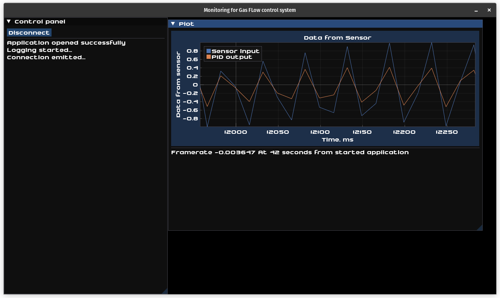
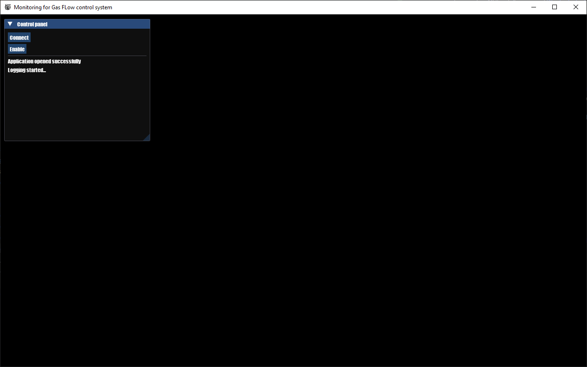

# Monitoring for Gas Flow Control System

## Overview

The Gas Flow Control System is a comprehensive solution
designed to revolutionize vacuum heat treatment technology.

This project encompasses three key components:
* a desktop application for precise hardware control,
* an embedded system for on-site operations,
* a web interface for real-time data access from any device. 

Our aim is to enhance accuracy, efficiency, and user experience 
in controlling gas flow, paving the way for the next generation
of vacuum heat treatment processes. 
This project is currently in the preparation phase for its 
upcoming release. Stay tuned for more updates!

This repository is first part of project: **Desktop application**.     

## References
* As a base of application was used [Dear ImGui framework](https://github.com/ocornut/imgui) 
* We lightly changed code of [jfoshea's PID-controller with auto-tuning](https://github.com/jfoshea/PID-Controller)
* For creating AppImage for Linux machines we used [LinuxDeploy utility](https://github.com/linuxdeploy/linuxdeploy)
* For creating MSI installer we used [Wix Toolset v3.11](https://github.com/wixtoolset/wix3)
* For showing plots we used [ImPlot lib for ImGui](https://github.com/epezent/implot)

## How to install

### Windows machines:
- [Go to Releases tab](https://github.com/OlegSirenko/Monitoring_GasFlowControll/releases)
- Download the latest MSI installer. 
- Run the installer on your machine by double-clicking it. It will install all necessary dll's and create desktop shortcut for executable. (Keep in mind application use DX11 as a system of rendering, so you will need to [install it](https://support.microsoft.com/en-au/topic/how-to-install-the-latest-version-of-directx-d1f5ffa5-dae2-246c-91b1-ee1e973ed8c2))
- There you can run monitoring application by double-clicking on it.

### Linux machines
- [Go to Releases tab](https://github.com/OlegSirenko/Monitoring_GasFlowControll/releases)
- Download the latest AppImage file.
- [Make the downloaded file executable](https://docs.appimage.org/introduction/quickstart.html)
- Run the AppImage file.

# Usage
The first time you opened the application you will see this:

 
You will need to click button ``Connect`` to emit connection to microcontroller.
When the connection is up, the ``Plot Window`` will show with input data:
