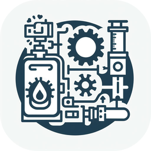
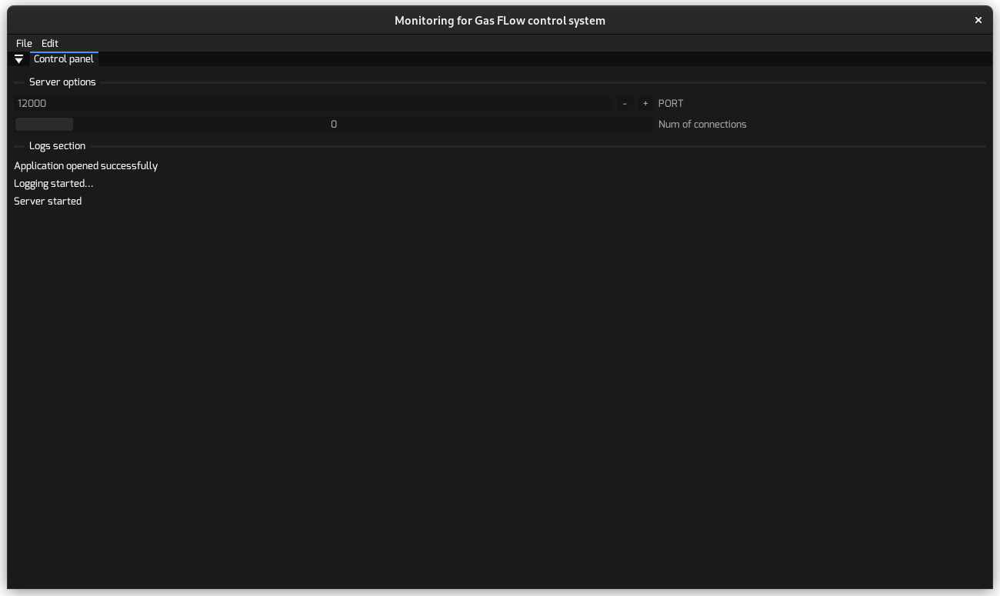
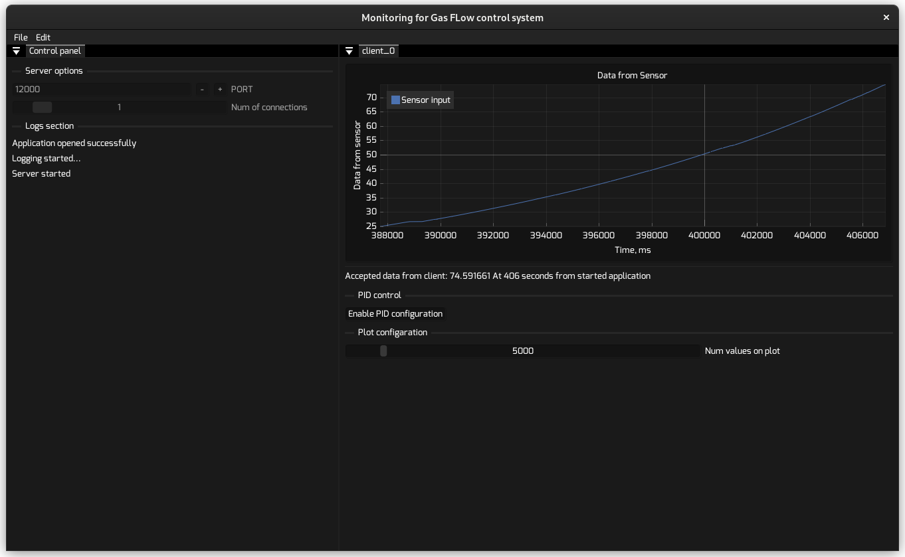
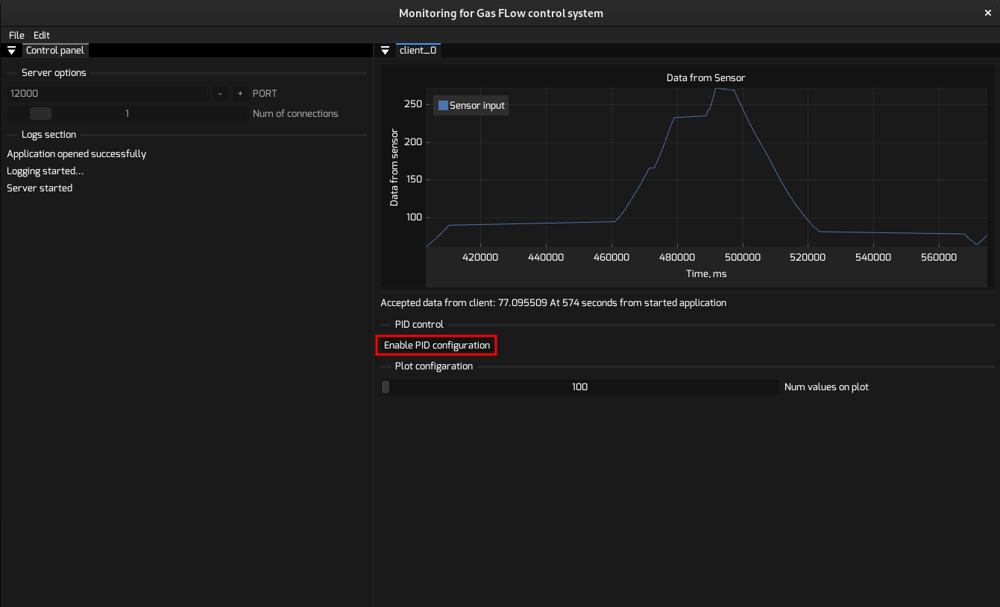
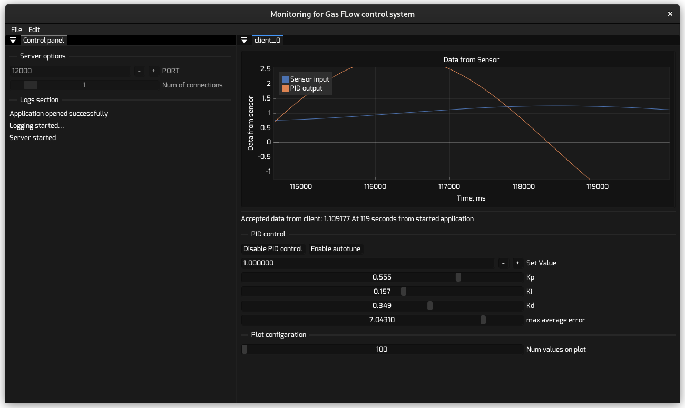
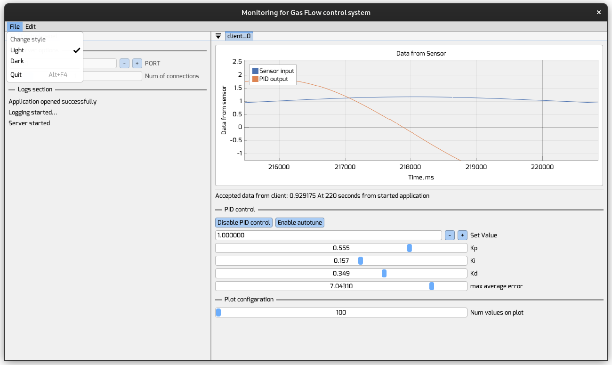

[//]: # ([![Linux Build]&#40;https://github.com/OlegSirenko/Monitoring_GasFlowControll/actions/workflows/cmake-single-platform.yml/badge.svg?event=push&#41;]&#40;https://github.com/OlegSirenko/Monitoring_GasFlowControll/actions/workflows/cmake-single-platform.yml&#41;)

[//]: # ([![Windows build]&#40;https://github.com/OlegSirenko/Monitoring_GasFlowControll/actions/workflows/cmake-single-platform-win.yml/badge.svg?event=push&#41;]&#40;https://github.com/OlegSirenko/Monitoring_GasFlowControll/actions/workflows/cmake-single-platform-win.yml&#41;)

[](https://github.com/OlegSirenko/Monitoring_GasFlowControll/actions/workflows/cmake-multi-platform.yml)
[](https://app.codacy.com/gh/OlegSirenko/Monitoring_GasFlowControl/dashboard?utm_source=gh&utm_medium=referral&utm_content=&utm_campaign=Badge_grade)
# Monitoring for Gas Flow Control System

<p align="center">
    
</p>

## Overview

The Gas Flow Control System is a comprehensive solution
designed to revolutionize vacuum heat treatment technology.

This project encompasses three key components:
* a desktop application for precise hardware control,
* an embedded system for on-site operations,
* a web interface for real-time data access from any device.

Our aim is to enhance accuracy, efficiency, and user experience
in controlling gas flow, paving the way for the next generation
of vacuum heat treatment processes.
This project is currently in the preparation phase for its
upcoming release. Stay tuned for more updates!

This repository is first part of project: **Desktop application**.

## References and Sources

* As a base of application was used [Dear ImGui framework](https://github.com/ocornut/imgui)
* We lightly changed code of [jfoshea's PID-controller with auto-tuning](https://github.com/jfoshea/PID-Controller)
* For creating AppImage for Linux machines we used [LinuxDeploy utility](https://github.com/linuxdeploy/linuxdeploy)
* For creating MSI installer we used [Wix Toolset v5.0.1](https://github.com/wixtoolset/wix)
* For showing plots we used [ImPlot lib for ImGui](https://github.com/epezent/implot)
* For network communication we used [Boost](https://github.com/boostorg/boost)

# How to install

### Windows machines:

* [Go to Releases tab](https://github.com/OlegSirenko/Monitoring_GasFlowControll/releases)
* Download the Installer.zip
* Run the Setup_GasFlowControl.exe
* Follow the instructions in the installer
* Run the executable GasFlowControl.exe. 

**Executable with all necessary files will be placed in the Program Files directory. 
Also, Installer creates shortcuts on the desktop and in the start menu**     

### Linux machines

* [Go to Releases tab](https://github.com/OlegSirenko/Monitoring_GasFlowControll/releases)
* Download the AppImage.zip file.
* Extract the Gas_Flow_Control_Monitor-x86_64.AppImage and imgui.ini from archive. 
* [Make the AppImage file executable](https://docs.appimage.org/introduction/quickstart.html)
* Run the AppImage file.

# How to use

The first time you opened the application you will see this:



When the Microcontroller (or multiple microcontrollers) connected to server application you will see that plot appeared:



You can enable PID regulation with button `Enable PID configuration`:

After clicking on `Enable PID configuration` the second line will appear on the plot:



**You could chnage theme by clicking `File -> Dark` or `File -> Light` in the `change style` section.**  



Microcontroller sends only one number as an actual Data from one sensor.
You can find the working example at the [SensorOutTest.py](Tests/Pid_regulator_test/SensorOutTest.py)


# Building

## Linux machines

Firstly you need to install CMake with dependencies
```shell
sudo apt update 
sudo apt upgrade
sudo apt install git make openssl libssl-dev 
git clone https://github.com/Kitware/CMake.git
cd CMake/
./bootstrap && make && sudo make install
```

### If you're using the latest Debian or Ubuntu

```shell
sudo apt-get install libsdl2-dev
```

### if you're NOT using the latest Debian or Ubuntu

Install SDL2 from source (if you're not using the latest Debian or Ubuntu)
```shell
git clone https://github.com/libsdl-org/SDL.git -b SDL2
cd SDL
mkdir build
cd build
../configure
make
sudo make install
```

When cmake and SDL2 was installed we could start building the application

```shell
sudo apt install libgl1-mesa-dev libglfw3-dev ninja-build  
git clone --recursive https://github.com/OlegSirenko/Monitoring_GasFlowControll.git 
cd Monitoring_GasFlowControll
cmake -DCMAKE_BUILD_TYPE=Release -DCMAKE_MAKE_PROGRAM=ninja -G Ninja -S . -B ./cmake-build-release
cmake --build ./cmake-build-release --target GasFlowControlMonitoringApp -j 6
```

After successful build you can run application using:
```shell
cd cmake-build-release 
./GasFlowControlMonitoringApp
```

To create an AppImage file you need to run the shell script: [run.sh](Deploy/AppImage/run.sh)
```shell
cd ../Deploy/AppImage && ./run.sh
```